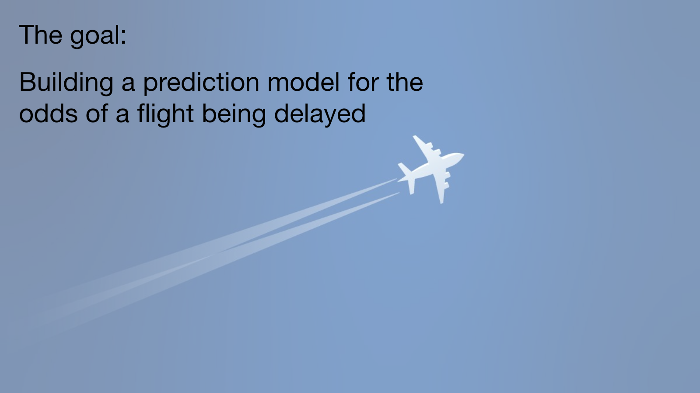
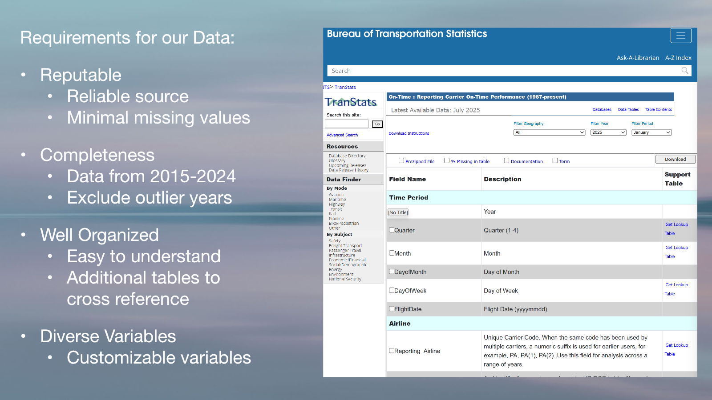
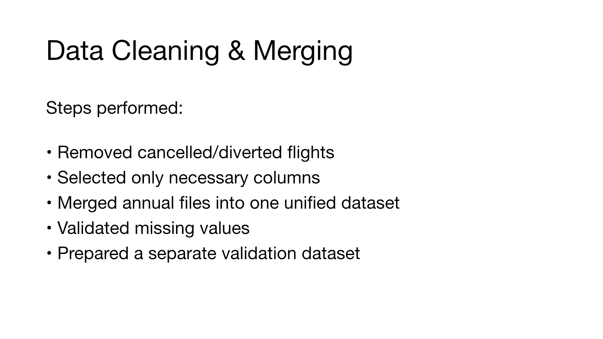
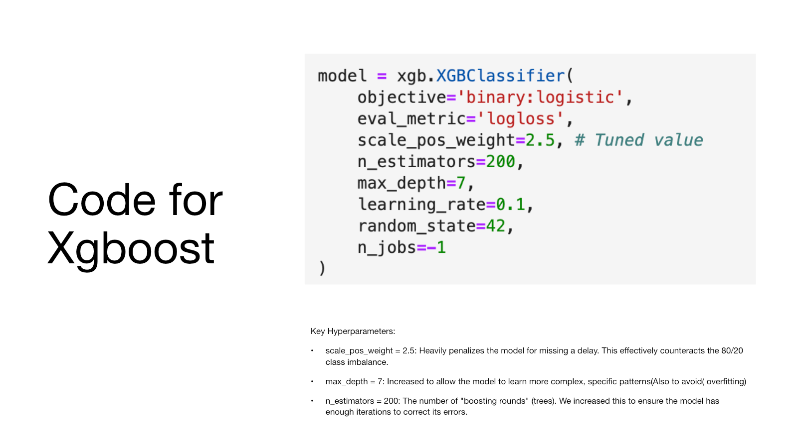
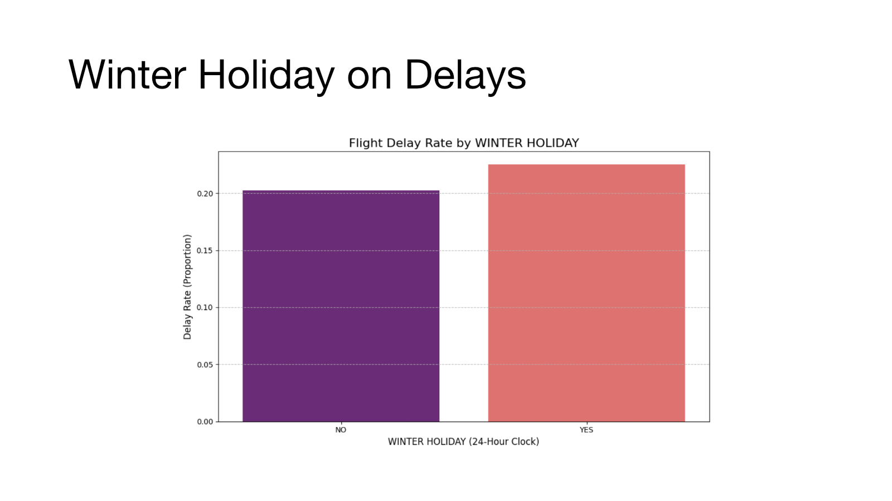
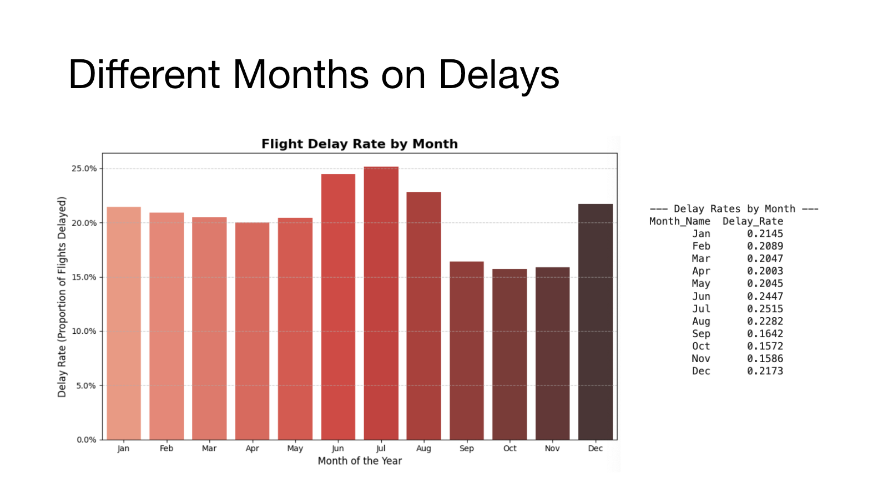
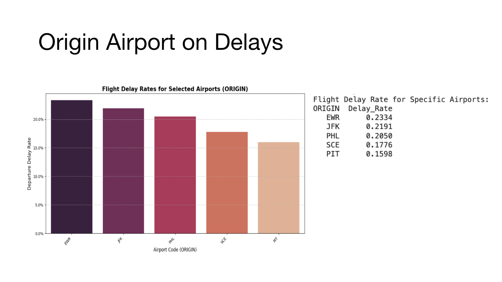

# Flight Delay Prediction

### Predicting Flight Delays from 14.5 Million U.S. Flight Records

  

## Project Overview

This DS/CMPSC 410 team project investigates whether flight delays can be
predicted during peak travel periods, particularly around the winter holidays,
at State College Airport and nearby major hubs.

We processed approximately 14.5 million U.S. flight records and compared
Random Forest and XGBoost models. We also analyzed how airports, airlines,
departure months, and holiday travel periods affected flight delays.

## Project Information

| Category | Details |
|---|---|
| Semester | Fall 2025 |
| Team | Data Pilots, six members |
| Dataset | U.S. flight records from 2015-2024, excluding 2020-2021 |
| Data Size | Approximately 14.5 million records |
| Objective | Predict whether a flight will depart more than 15 minutes late |
| My Role | Data acquisition and preprocessing, conceptualization, and report review and editing |

## My Contribution

- Collected and organized annual flight records from the U.S. Department of Transportation
- Selected 11 essential columns from 15 partitioned CSV files
- Removed cancelled, diverted, and incomplete flight records
- Converted scheduled departure times into hour-based features
- Created a `winter_holiday` feature for the December 1-January 10 travel period
- Reviewed the final analysis, performance metrics, and written conclusions

## Technologies

`Python` `Pandas` `NumPy` `PySpark` `Scikit-learn`
`XGBoost` `Matplotlib` `Seaborn` `Roar-Collab`

## Data Processing

  

1. Collected and combined annual flight datasets
2. Removed cancelled, diverted, and incomplete records
3. Created departure-time and winter-holiday features
4. Defined a delay as a departure more than 15 minutes late
5. Prepared the data for Random Forest and XGBoost training

  

## Modeling

Approximately 80% of the flights were on time, while only 20% were delayed.
This created a significant class-imbalance problem.

For XGBoost, we used `scale_pos_weight=2.5`, `max_depth=7`, and
`n_estimators=200` to improve the model’s ability to detect delayed flights.

  

## Key Findings

- The winter-holiday period had only a minor effect on overall delay rates.
- Delay rates were highest around July and December.
- EWR and JFK had higher departure-delay rates than SCE and PIT.
- Airport, airline, and departure month were important predictive features.
- XGBoost achieved 65% overall accuracy and detected 61% of delayed flights.
- Its delayed-flight precision was 31%, indicating a tradeoff between detection and false alarms.

  
  
  

## Limitations and Future Work

Class imbalance made it difficult to detect delays without increasing false
alarms. Future work could incorporate weather and airport-congestion data,
experiment with additional sampling strategies, and further tune the
classification threshold and model hyperparameters.

## Project Materials

- [View the Final Report](docs/DS410_Final_Report.pdf)
- [View the Presentation](docs/DS410_Presentation.pdf)
- [Download the Original PowerPoint](docs/DS410_Presentation.pptx)
- [View the Modeling Notebook](Models.ipynb)
- [View the Visualization Notebook](Visualizations.ipynb)
